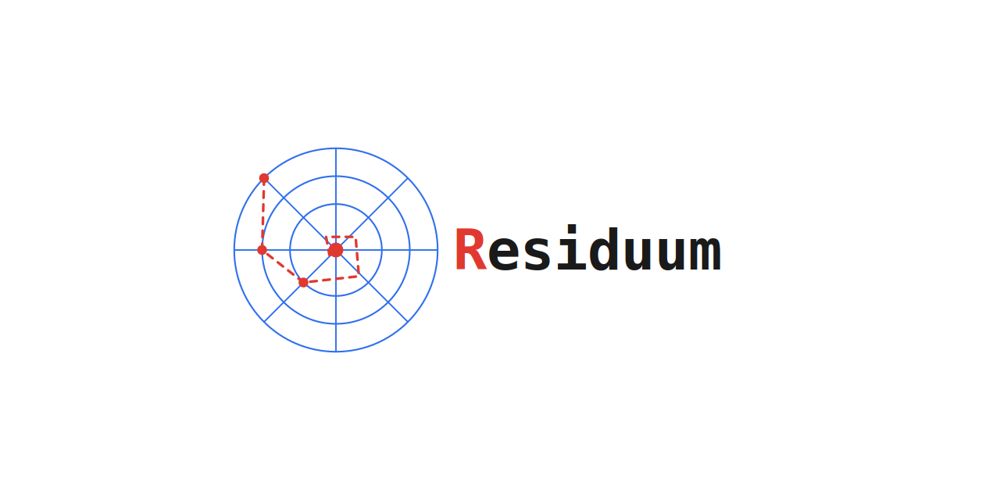

<p align="center">
  
</p>

<h1 align="center"></h1>

# Residuum

A modular finite element (FEM) PDE solver written in modern C++20, built around a
backend-agnostic (CPU/CUDA), concept-constrained template architecture and driven entirely by
YAML configuration — no recompilation needed to change a mesh, boundary condition, or solver
strategy.

## Highlights

- **Concept-constrained generic core.** Every extension point in the assembly/solver pipeline —
  quadrature-point evaluators, weak forms, linear operators, solver drivers — is a C++20
  `concept`, enforced at the actual call sites rather than left as documentation. Adding a new PDE
  means implementing a handful of well-defined interfaces, not touching the assembler.
- **Backend-agnostic by design.** Core containers and kernels (`linalg/types`, `fem/assembly`,
  `fem/boundary`) are templated on a `Backend` tag (`CPU`/`CUDA`) so a GPU specialization is a
  drop-in, not a rewrite — CUDA support is planned, not retrofitted.
- **Runtime-dispatched, compile-time-templated.** A YAML config resolves basis type, quadrature
  rule, and backend at runtime into a concrete, fully templated `Stage`, so the hot assembly loop
  stays branch-free and monomorphic while the CLI stays fully config-driven.
- **Composable solver architecture.** `Steady`/`Transient` drivers, single-physics or
  `SegregatedStage`-composed multi-physics stages (think: a pressure-velocity stage run with
  Newton+GMRES followed by a turbulence stage run with Picard+GMRES, swept each outer iteration),
  and pluggable linear/nonlinear solvers all compose through the same `Stage` interface.
- **Config-driven physics, zero recompilation.** Materials, boundary conditions, initial
  conditions, and solver settings — including runtime math expressions (`exprtk`) for BCs and
  source terms — are all specified in YAML; the same binary runs any config for a given equation.

## Status

Actively developed, solo project. The heat equation (`equation/heateq`) is the current focus and
is functionally complete: steady and transient (Backward Euler) solves, linear and nonlinear
(temperature-dependent) material models, essential/natural boundary conditions, file- and
expression-driven fields, monitors/quantities, VTK output. Elasticity and an incompressible RANS
solver (as a stretch goal demonstrating VMS stabilization) are next on the roadmap, followed by
CUDA and MPI-distributed backends — see [Architecture](#architecture) for how the codebase is
already shaped for both.

## Quick start

```bash
git clone <repo-url> residuum && cd residuum
mkdir build && cd build
cmake .. -DCMAKE_BUILD_TYPE=Release
make -j$(nproc)
export PATH="$PWD/bin:$PATH"
cd ..

cd examples/mesh/square && mesh config.yaml && cd -
cd examples/heateq/steady/constant_conductivity/2d && heateq config.yaml && cd -
```

Configs reference other files (meshes, field data) by path relative to the *current directory*,
not the config file's own location — run each example from inside its own directory, as above.

Dependencies: a C++20 compiler, CMake ≥ 3.18, [`yaml-cpp`](https://github.com/jbeder/yaml-cpp),
[`GoogleTest`](https://github.com/google/googletest) (for the test suite), and
[`exprtk`](https://github.com/ArashPartow/exprtk) (header-only).

Every physics run is a YAML file — mesh, materials, boundary conditions, solver, and output are
all declared, not coded:

```yaml
materials:
  conductivity:
    type: constant
    value: 1.0
    unit: W/(m*K)

boundary_conditions:
  - boundary: 0
    type: value
    read:
      mode: expression
      expression: "(1-x)*(1-y)"
      unit: K
    forms: [value_bc]
```

See `examples/` for steady, transient, nonlinear-conductivity, anisotropic-conductivity, and
Gmsh-imported-geometry configs (including a U-bend demo).

## Architecture

```
equation/<physics>   PDE-specific weak forms, models, boundary functions (currently: heateq)
application/<app>     CLI entry points; config parsing → Dispatcher → templated Stage
solver/               Drivers (Steady/Transient), stages, linear/nonlinear solvers, timesteppers
fem/                  Assembly, basis functions, quadrature, boundary application, quantities
linalg/               Backend-templated containers, operators, iterative/direct solvers
mesh/, io/            Mesh generation/import (Gmsh), field & VTK I/O
```

Dependencies flow strictly bottom-up. `fem`, `linalg`, and `equation` are header-only (template
implementations live in `.tpp` files alongside their headers); `mesh`, `io`, and `solver`'s config
parsers compile into static libraries. A CMake package config (`find_package(Residuum)`) is
available for downstream consumption — see `cmake/ResiduumConfig.cmake.in`.

## Testing

```bash
cd build
ctest                                          # full suite
ctest -R UnitTest_Fem_Basis_Lagrange           # by name/regex
ctest -R IntegrationTest_Full_Heateq_Cpu --output-on-failure
```

Unit tests mirror `include/`'s directory structure exactly; integration tests are nested by
physics module, then by tier (`fem/` exercises the assembly layer directly, `full/` runs the
complete config → driver → output pipeline), then by backend.

## License

MIT — see [LICENSE](LICENSE).
