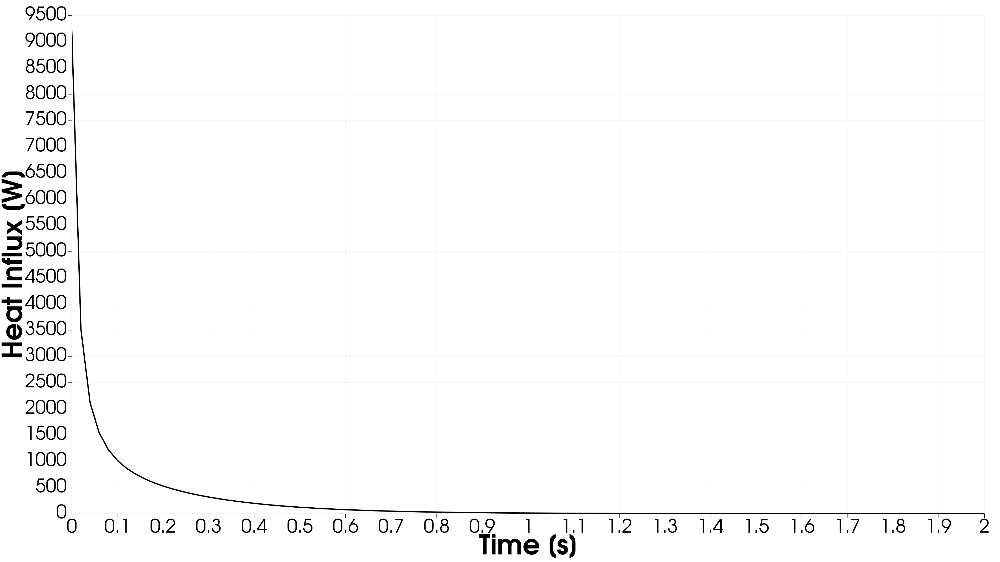
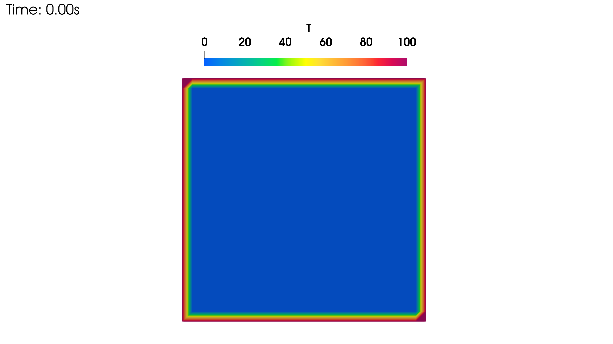
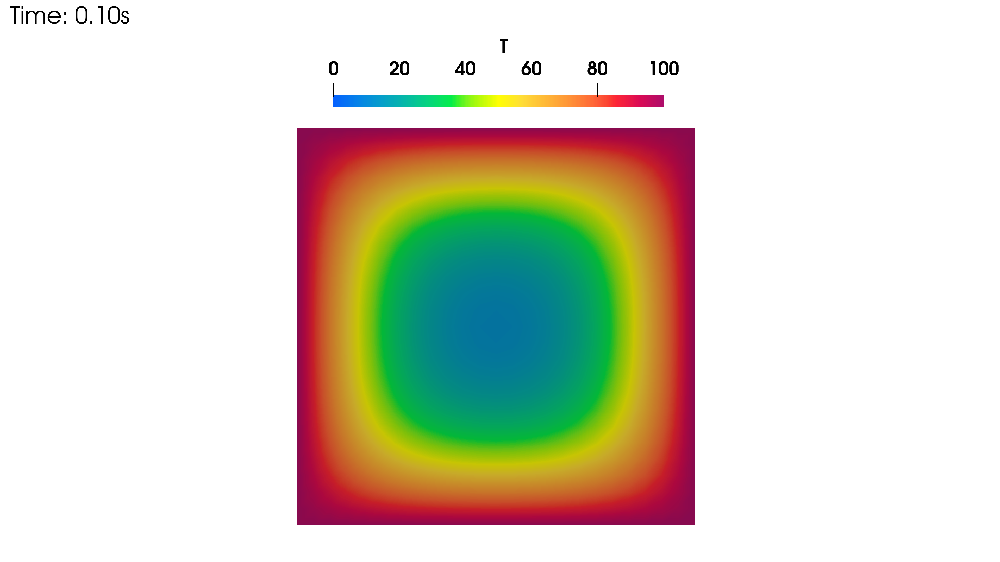
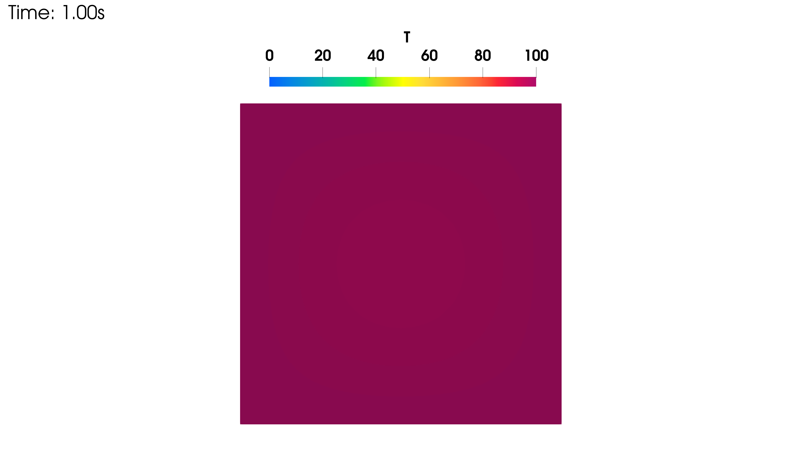
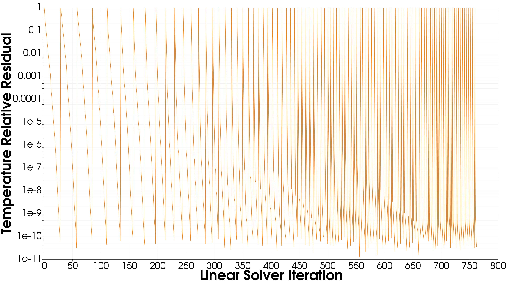

# Tutorial: transient heating of a block

This tutorial walks through `examples/heateq/transient/heating_block`, a small transient heat
conduction problem. This example exercises the transient driver, the Backward Euler timestepper, an iterative linear solve, a monitor, and time series output. It
is a good first transient example to read start to finish.

## The problem

The domain is a 1 by 1 square, uniform and isotropic, initially at 0 K. At time zero, all four
edges are held at 100 K and kept there for the remainder of the run. Heat conducts inward from the
boundary until the whole domain approaches 100 K.

This particular setup, a square held at a uniform boundary temperature starting from a uniform
initial condition, has a known analytical solution in the form of a Fourier series, which makes it
a reasonable configuration to validate a transient conduction implementation against, beyond just
checking that it runs.

## Configuration walkthrough

The mesh section points at a pre-generated `square.pmsh`, produced by the `mesh` application from
`examples/mesh/square/config.yaml`.

```yaml
mesh:
  file: square.pmsh
```

Materials are constant and isotropic: a conductivity, a density, and a specific heat, each a
single scalar value with its physical unit stated explicitly.

```yaml
materials:
  conductivity:
    type: constant
    value: 1.0
    unit: W/(m*K)
  density:
    value: 1.0
    unit: kg/m^3
  specific_heat:
    value: 1.0
    unit: J/(kg*K)
```

There is no volumetric source, so the source expression is identically zero.

The four boundary conditions are all of `type: value` (an essential, Dirichlet condition) at
100 K, one for each of the four boundary segments of the square. The initial condition sets the
whole domain to 0 K.

The `solver` section is where this example becomes transient. The driver type is `transient`,
paired with a `backward_euler` timestepper running from $t=0$ to $t=2$ seconds at a fixed step
size of 0.02 seconds. Each step's linear system is solved with CG against the identity
preconditioner, using the matrix-free (`fem`) operator rather than an explicitly assembled matrix.

```yaml
solver:
  driver:
    type: transient
  timestepper:
    type: backward_euler
    t0: 0.0
    tf: 2.0
    step_size:
      mode: constant
      dt: 0.02
  linear:
    type: cg
    operator:
      type: fem
    preconditioner:
      type: identity
    tolerance: 1.0e-10
    max_iterations: 10000
```

A monitor integrates heat flux over all four boundaries, with a coefficient of $-1$ on each so
that the reported quantity is net influx into the domain rather than outflux. This is written both
to the console and to a CSV file at every accepted step.

Output is written as a VTU time series, one file per step, so a full time history of the
temperature field can be viewed as an animation in ParaView or a similar tool.

## Running it

```bash
cd examples/heateq/transient/heating_block
heateq config.yaml
```

This produces a VTU file per timestep under `output/`, a monitor CSV at
`output/monitors/net_influx.csv`, and solver and driver logs.

## What to expect

The net influx monitor should start near its largest magnitude immediately after the boundary
temperature jumps, when the temperature gradient at the boundary is steepest, and decay smoothly
toward zero as the domain equilibrates toward 100 K everywhere. By $t=2$, the domain should be
close to uniformly at 100 K, and the influx should be close to zero.

1. Net Heat Influx

<p align="center">
  
</p>

<h1 align="center"></h1>

2. Solution Field

<p align="center">
  
</p>

<h1 align="center"></h1>

<p align="center">
  
</p>

<h1 align="center"></h1>

<p align="center">
  
</p>

<h1 align="center"></h1>

<p align="center">
  
</p>

<h1 align="center"></h1>

3. Solver Convergence

<p align="center">
  
</p>

<h1 align="center"></h1>
